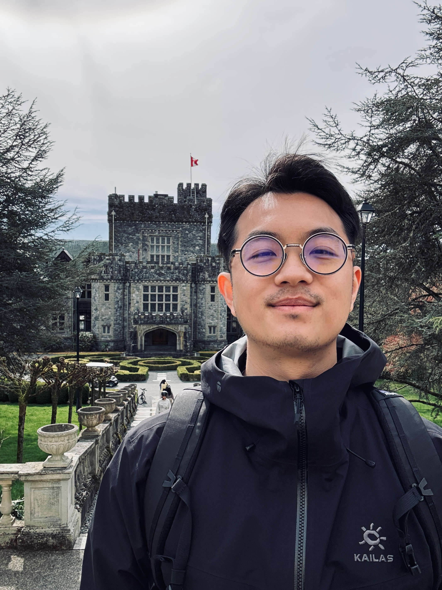

ML Engineer &amp; Data Scientist

Raymond(Wenrui) Wang

Vancouver, BC or Anywhere

ML Engineer and Data Scientist with 3+ years of industry experience building production
LLM systems, GenAI data pipelines, and computer vision models. Shipped a GPT-powered news intelligence
platform at scale, a full CV pipeline trained on HPC infrastructure, and a LangGraph-orchestrated
multi-agent compliance system. Currently building a RAG search engine with BM25, TF-IDF, and
semantic retrieval. Comfortable owning the full loop from data ingestion and model training through to
serving and evaluation — actively building toward fine-tuning.

  <a href="#projects" class="btn-mini btn-mini-primary">View Projects →</a>
  <a href="https://github.com/raymondww" target="_blank" class="btn-mini btn-mini-ghost">GitHub ↗</a>
  <a href="blog/index.html" class="btn-mini btn-mini-ghost">Read the Blog →</a>

## Recent Activities {#recent}

01

<strong>AI-Driven KYC Onboarding &amp; Compliance Engine —</strong> Architected a
three-stage, jurisdiction-aware onboarding pipeline (fraud gate → OCR / face-match / liveness verification →
OSINT compliance agent). Built a LangGraph-orchestrated compliance agent screening applicants against a real
7,495-entry OFAC sanctions list with a local LLM producing risk summaries.

02

<strong>Computer Vision Researcher, UBC Animal Welfare Program —</strong>
Fine-tuned YOLO on 1,100 annotated clips across 8 experimental splits to detect cross-sucking behaviour in
dairy calves, achieving 0.73 average temporal IoU against a 0.70 baseline — full pipeline from 300GB of raw
barn footage to automated evaluation reports on SLURM HPC.

03

<strong>RAG Search Engine —</strong> Building a full-stack retrieval system from
scratch — BM25 keyword ranking, TF-IDF scoring, an inverted index, and semantic search using
sentence-transformer embeddings with chunking strategies and hybrid retrieval, served via FastAPI and
deployed on Render.

04

<strong>Actively seeking ML / DS roles —</strong> Open to ML engineering and
data science positions, with particular interest in roles involving end-to-end pipeline ownership, applied
NLP, and forecasting at scale — actively building toward fine-tuning.

## Education {#education}

Master of Data Science

University of British Columbia

Aug 2025 – Jun 2026

MicroMasters: Statistics &amp; Data Science

MIT Open Learning

May 2023 – Jan 2025

Bachelor of Commerce: Business Technology Management

Toronto Metropolitan University (formerly Ryerson University)

Sep 2016 – Jun 2021

## Technical Skills {#skills}

Languages

Python, R, SQL, Bash

ML &amp; GenAI

PyTorch, scikit-learn, LLM APIs, LangChain, LangGraph, YOLO, OpenCV, DeepFace

RAG &amp; Retrieval

BM25, TF-IDF, semantic search, vector embeddings, FAISS (in progress)

Data Engineering

Apache Airflow, Spark, ETL pipeline design, REST API scraping, OCR, fuzzy matching / entity resolution

Cloud &amp; Infra

AWS S3, Azure, Alibaba Cloud, Docker, Git, SLURM, HPC distributed training, streaming APIs, MLflow

Visualisation

Tableau, Power BI, Quarto, MkDocs

## Projects {#projects}

In Progress

RAG Search Engine

Full-Stack NLP · BM25 · Semantic Search · FastAPI

Building a full-stack retrieval system from scratch — implementing
<strong>BM25 keyword ranking</strong>, <strong>TF-IDF scoring</strong>, an inverted index, and semantic
search using sentence-transformer embeddings with chunking strategies and hybrid retrieval. Served via a
<strong>FastAPI</strong> backend and deployed on Render.

  BM25TF-IDFInverted Index
  Sentence-TransformersHybrid RetrievalFastAPI
  PythonRender

<a href="https://github.com/raymondww/rag-search-engine" target="_blank" class="card-link">GitHub →</a>

Live Demo — BM25 Movie Search

<input type="text" id="search-input" placeholder="Try: animated family, sci-fi space, action heist..." style="flex:1;background:transparent;border:none;outline:none;padding:0.65rem 0.9rem;font-family:'DM Mono',monospace;font-size:12px;color:var(--text);" />
<button onclick="runSearch()" style="background:var(--text);border:none;color:var(--bg);padding:0 1rem;font-family:'DM Mono',monospace;font-size:10px;letter-spacing:0.08em;text-transform:uppercase;cursor:pointer;">Search</button>

Enter a query to search 5,000 movies using BM25 ranking.

Complete

AI-Driven KYC Onboarding &amp; Compliance Engine

LangGraph · OSINT Agent · OCR / Face-Match / Liveness · Config-Driven Routing

Architected a three-stage, jurisdiction-aware onboarding pipeline (behavioral fraud gate
→ OCR / face-match / liveness verification → OSINT compliance agent) as a single generator function reused,
unmodified, by both a live streaming API and a CLI batch script, with zero duplicated business logic.
Config-driven country routing adds a new jurisdiction with one JSON entry, no new code branch. Built a
<strong>LangGraph-orchestrated</strong> compliance agent screening applicants against a real 7,495-entry OFAC
sanctions list (fuzzy name / DOB matching), live adverse-media and court-record search, with a local LLM
(Ollama) producing a LOW / MEDIUM / HIGH risk summary — keeping the sanctions match deterministic and
independent of the LLM output to bound hallucination risk in a compliance-critical decision.

  LangGraphOCRFace Match
  Liveness DetectionOSINTOFAC Screening
  OllamaPython

Demo Recording

<video controls preload="metadata"><source src="videos/kyc_demo.mp4" type="video/mp4"></video>

Complete · Capstone · UBC 2026

MooVision

Computer Vision · YOLO Fine-tuning · Seq-NMS · HPC / SLURM

Automated dairy calf cross-sucking behavior detection system built as UBC MDS Capstone
in partnership with the <strong>UBC Animal Welfare Program</strong>. Fine-tuned <strong>YOLO</strong> on
1,100 annotated clips across 8 experimental splits — achieving <strong>0.73 average temporal IoU vs 0.70
baseline</strong>. Engineered the full pipeline from <strong>300GB of raw barn footage</strong> to automated
evaluation reports: OpenCV clipping, proximity-based baseline, Seq-NMS temporal linking, and a Makefile
workflow integrating preprocessing, SLURM-parallelised HPC training, inference, and Quarto report generation.

  YOLOSeq-NMSOpenCV
  PyTorchSLURM / HPCDocker
  QuartoPythonF2 MetricAnimal Welfare

Demo Recording

<video controls preload="metadata"><source src="videos/moovision_demo.mp4" type="video/mp4"></video>

<a href="https://github.com/UBC-AWP/mooVision" target="_blank" class="card-link">GitHub →</a>

## Hackathon Demo {#hackathon}

Complete · JLL Internal

GPT-Powered Web Data Extraction Platform

LLM · Flask · Selenium · Runtime Code Generation · Azure

Built at an internal JLL hackathon following the public release of GPT-3.5. A Flask
web platform that lets non-technical analysts extract structured data from <em>any</em> website — no code
required. Under the hood: <strong>Selenium</strong> renders dynamic JS pages, <strong>BeautifulSoup</strong>
parses the loaded HTML, and <strong>GPT-3.5 on Azure</strong> generates Python extraction code at runtime
using <code>exec()</code> — inferring the page structure from user-provided sample values.

  GPT-3.5FlaskSelenium
  BeautifulSoupAzure OpenAIRuntime Code GenerationPython

Demo Recording

<video controls preload="metadata"><source src="videos/hackathon_demo.mp4" type="video/mp4"></video>

